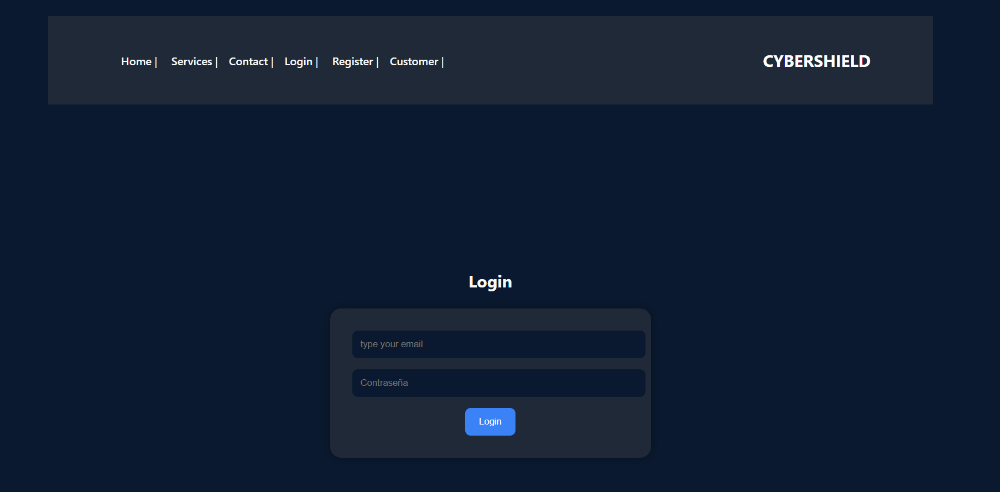
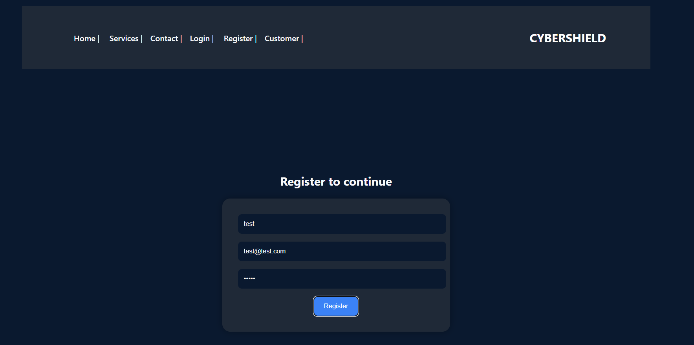
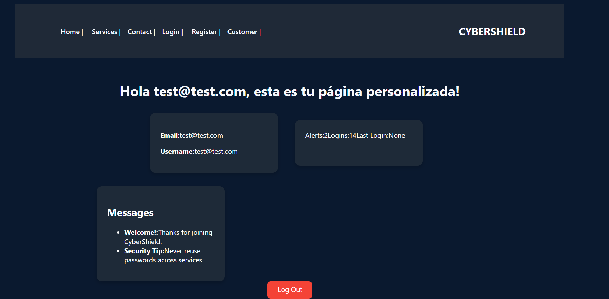

# 🛡️ CybersecurityWeb


This website is meant to be for a cybersecurity company. It includes user authentication and a personalized page for clients.
Sitio web fullstack para una empresa de ciberseguridad. Incluye autenticación de usuarios y una sección personalizada para clientes.

🔗 **Live demo / Demo en vivo:** [cybersecurity-web-omega.vercel.app](https://cybersecurity-web-omega.vercel.app)
🔗 **Backend API:** [cybersecurityweb.onrender.com](https://cybersecurityweb.onrender.com)

> ⚠️ **Note / Nota:** This project uses SQLite for demo purposes. Since Render's free tier has an ephemeral filesystem, registered users are reset on each backend redeploy — this is expected behavior for a portfolio demo, not a bug.
> Este proyecto usa SQLite con fines de demostración. Como el plan gratuito de Render tiene un sistema de archivos efímero, los usuarios registrados se reinician en cada redeploy del backend — es un comportamiento esperado para una demo de portafolio, no un error.

---

## 📸 Screenshots

### Login


### Register


### Customer dashboard


---

## 🚀 Technologies

**Frontend:**
* React.js
* React Router
* Vite
* HTML, CSS, JavaScript

**Backend:**
* Python
* Django
* Django REST Framework
* JWT (autenticación)
* django-axes (brute-force protection)

**Infrastructure / Infraestructura:**
* GitHub Actions (CI/CD)
* Vercel (frontend hosting)
* Render (backend hosting)

---

## 💻 Functionality

* Home Page / Página de inicio institucional
* User registration / Registro e inicio de sesión de usuarios
* Customer page / Página personalizada para cada cliente
* Authentication JWT / Autenticación basada en token JWT
* Styled with blue, lightblue, grey and black / Estilizado con tonos de azul, celeste, gris y negro

---

## 🔒 Security

This project follows several security best practices:
Este proyecto sigue varias buenas prácticas de seguridad:

- Secrets (SECRET_KEY, etc.) are never committed to source control — managed via environment variables / Los secretos nunca se suben al repositorio, se gestionan por variables de entorno
- Brute-force login protection via django-axes (IP + username lockout) / Protección contra fuerza bruta en el login
- JWT access/refresh token rotation with blacklisting / Rotación y blacklist de tokens JWT
- Automated dependency vulnerability scanning in CI (pip-audit, npm audit) / Escaneo automático de vulnerabilidades en dependencias

See [SECURITY.md](./SECURITY.md) for full details.
Ver [SECURITY.md](./SECURITY.md) para más detalles.

---

## 🧪 How to run the project locally / Cómo correr el proyecto localmente

### 📁 Clone the repository / Clonar el repositorio

```bash
git clone https://github.com/mgisellemelo/CybersecurityWeb.git
cd CybersecurityWeb
```

### ⚙️ Backend (Django)

```bash
cd backend
python -m venv env
source env/bin/activate  # en Windows: env\Scripts\activate
pip install -r requirements.txt
```

Create a `.env` file in `backend/` based on `.env.example` / Crea un archivo `.env` en `backend/` basado en `.env.example`:
```
SECRET_KEY=your-secret-key-here
DEBUG=True
```

```bash
python manage.py migrate
python manage.py runserver
```

### 🌐 Frontend (React)

```bash
cd frontend
npm install
```

Create a `.env` file in `frontend/` / Crea un archivo `.env` en `frontend/`:
```
VITE_API_URL=http://localhost:8000
```

```bash
npm run dev
```

---

## 🧾 Autenticación

Se utiliza JWT:

- Users get an access token and refresh token to login / Los usuarios reciben un token de acceso y refresh al iniciar sesión.
- Private routes require a token / Las rutas privadas requieren el token.
- Failed login attempts are rate-limited to prevent brute-force attacks / Los intentos fallidos de login están limitados para prevenir ataques de fuerza bruta.

---

## 🔄 CI/CD

Every push runs an automated pipeline via GitHub Actions:
Cada push ejecuta un pipeline automatizado vía GitHub Actions:

- Backend test suite (authentication flows) / Suite de tests del backend (flujos de autenticación)
- Frontend build verification / Verificación de build del frontend
- Dependency vulnerability audits / Auditoría de vulnerabilidades en dependencias
